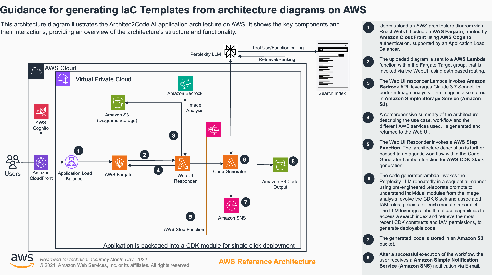

# Guidance to Generate IaC Templates Directly from Architecture Diagrams

## Table of Contents
- [Overview](#overview)
  - [Cost](#cost)
- [Prerequisites](#prerequisites)
  - [Operating System](#operating-system)
- [Deployment Steps](#deployment-steps)
- [Deployment Validation](#deployment-validation)
- [Running the Guidance](#running-the-guidance)
- [Next Steps](#next-steps)
- [Cleanup](#cleanup)
- [FAQ, Known Issues, Additional Considerations, and Limitations](#faq-known-issues-additional-considerations-and-limitations)
- [Revisions](#revisions)
- [Notices](#notices)
- [Authors](#authors)

## Overview
The Journey from Architecture drawings to their deployment can be vastly accelerated by leveraging the potential of Large Language Models. However, given that IaC tools like AWS CDK(Cloud Development Kit) evolve rapidly with frequent new releases/updates, leveraging stand alone LLMs trained in the past often leads to inaccuracies and hallucinations when they are used to produce IaC stacks using AWS CDK.

In addition, for architecture drawings that have higher levels of complexity, highly elaborate and nuanced prompts are essential to produce truly deployable IaC templates. Prompting efforts from the user also scale exponentially as the complexity levels of the architecture under consideration are increased. Architec2Code AI only expects a nuanced Architecture drawing with no additional prompts required from the user. 

This guidance helps users to produce accurate, natively modular, nuanced AWS CDK stacks in Python and TypeScript with the CDK constructs/syntax retrieved from the latest AWS CDK release, only using an architecture drawing. In addition, the required IAM Roles and permissions are also identified automatically and added to the stacks automatically during the code generation process. This is achieved using highly optimized Chain of Thought (CoT)  prompting for IaC generation in combination with multi step reasoning and search grounding capabilities of online LLM’s.

Architec2Code AI  with its intrinsic multi-agentic design , leverages the multimodal capabilities of LLMs in combination with carefully optimized Prompts to produce a nuanced understanding of the provided architecture - analyzing not only the individual resources present, but distinct functional modules, interactions between AWS resources or account boundaries that maybe depicted in the architecture, informing the code generation process accordingly.



1. An Amazon EC2 instance acts as the Streamlit webserver for the application frontend.  It accepts the architecture diagram uploaded by the user as an input 
2. The uploaded diagrams are stored on a Amazon Simple Storage Service (Amazon S3) bucket. 
3. The Streamlit responder Lambda invokes Amazon Bedrock API to perform an Image analysis.
4. A comprehensive summary of the architecture describing use case, workflow and the different AWS services used is generated and returned to the frontend.  
5. The generated architecture description is further passed to a chain of thought processing for AWS CDK code generation. 
6. The step function workflow generates a modular AWS CDK stack in the language of choice provided by the user.
7. The generated  code is stored in a Amazon Simple Storage Service (Amazon S3) bucket.
8. After a successful execution of the workflow, users receives a Amazon Simple Notification Service (Amazon SNS) notification with a pre-signed URL to download the generated AWS CDK scripts as a zip file. A prior subscription to the SNS topic from the user is a pre-requisite to receive the said notifications .

### Cost
You are responsible for the cost of the AWS services used while running this Guidance. The cost for running this Guidance with the default settings in the us-west-2 (Oregon) region is approximately $20 per month for conversion of around 50 architecture diagrams to IaC. Also major portion of the costs is a fixed cost related to the EC2 instance being used to host the Streamlit web application. 
 We recommend creating a Budget through AWS Cost Explorer to help manage costs. Prices are subject to change. For full details, refer to the pricing webpage for each AWS service used in this Guidance.

## Prerequisites

### Operating System
- This Guidance can be deployed using Windows, MacOS, or Linux. 
- An IDE, AWS CDK and AWS CLI are required.
- NPM installed
- Docker - IMPORTANT: In your Docker settings, verify that "Use containerd for pulling and storing images" is disabled. This setting causes issues with pushing Docker images to AWS ECR

### Third Party Tools
Perplexity API Key - Perplexity account and subscription required. 
NOTE: Our team has evaluated Perplexity to provide the best results for this use case. Other providers can be substituted in place of Perplexity as is determined to best suit your requirements. To replace Perplexity with another model, update the code_generator_utils_v2.py file within the code-generator Lambda function with the url of the alternative model and obtain an API key. Customer's use of Perplexity or another third-party tool of their choosing is subject to the terms and conditions of such tool and it is Customer's sole responsibility to ensure they oblige by such terms.

### AWS Account Requirements
Approved Bedrock access to Claude 3.5 Sonnet and Claude 3.7 Sonnet in the desired deployment region.

### Supported Regions
Any region that supports the required Claude models on Bedrock is a viable deployment target. 
This currently includes: us-east-1, us-west-2, eu-central-1, ap-northeast-1, and ap-southeast-1.
NOTE: us-east-1 is currently experiencing throttling issues with Claude 3.7 Sonnet. Deployment to other regions is strongly advised.

## Deployment Steps

### 1. Clone Repository
Clone the Github repo.
```bash
git clone git@github.com:aws-solutions-library-samples/guidance-for-developing-infrastructure-as-code-templates-from-architecture-diagrams-on-aws.git
```
### 2. Edit configuration files
Open the project folder in your IDE and edit the following files:
- export_vars.sh - This file contains all of the necessary deployment configuration environment variables. Update the placeholder values with the correct ones for your targeted deployment account.
- (OPTIONAL) package.json  - The config section of this file can be modified to change the Application Name and CDK Qualifier
- (OPTIONAL) cdk.json - The CDK Qualifier must also be updated here if modifying.
- (OPTIONAL) bin/datahackathon.ts - Update the recipientEmailAddresses array under the ProcessingStack with user emails who wish to receive notifications when newly generated code is uploaded to the S3 output bucket. 

### 3. Make the script executable and source the variables
Open your IDE CLI and run the follwing commands:
```bash
chmod +x export_vars.sh
source export_vars.sh
```
NOTE: For updates and future deplyoments, the 'source' command needs to be run every time a new CLI session is created to set the environment variables.

### 4. Install dependencies
Install the required CDK dependencies.
```bash
npm ci
```

### 5. Bootstrap the account
Prepare the account for CDK deployment.
```bash
cdk bootstrap --profile $AWS_PROFILE --qualifier ${CDK_QUALIFIER} aws://${AWS_ACCOUNT_ID}/${AWS_REGION}
```

### 6. Create AWS Secret and Upload API Key
In the AWS Console, navigate to Secrets Manager create a new secret with the name 'A2C_API_KEY' and the value set to your Perplexity API key.

### 7. Deploy
Deploy the project using CDK.
```bash
cdk deploy --all --require-approval never
```

## Deployment Validation
Open CloudFormation console and verify the status of the three stacks that were deployed: 'A2C-AI-StorageStack', 'A2C-AI-ProcessingStack' and 'A2C-AI-FrontEndStack'.

If deployment is successful, you should see a running EC2 instance with the name "A2C-AI-FrontEndStack/StreamlitServer" in the EC2 console.
Configuration of the EC2 instance takes approximately 3 to 5 minutes after stack deployment completes. Please allow extra time for this to happen before proceeding.
 
Verify that the web page is functioning correctly by navigating to the CloudFormation console, selecting the FrontEndStack, and selecting the Outputs tab. Here you will see the public DNS name of the instance that will open the server’s public web page. Note: The page is accessible over HTTP only, not HTTPS. Verify that your browser is not defaulting to an HTTPS connection if experiencing connection issues.

## Running the Guidance
1. Navigate to the web page
2. Upload a high quality PNG image of a AWS Architecture diagram for any Data Platform type architecture. These are generally derived from the AWS Modern Data Architecture Framework - reflecting capabilities for streaming, ETL, ingestion type architectures encompassing AWS Data, Analytics and Database services. A folder of architecture diagram samples has been provided in this repo.
3. A2C AI will first analyse the drawing and provide a response to the answer with a description of what it sees, also initiating the workflow for code synthesis in parallel. 

## Next Steps
Users can explore the following customizations to adapt/optimize the solution to their preferences

1. Model Selection: The model used for code generation can be selected from the list of supported models by the API provider. For Perplexity, the information can be found here . For Architecture diagram analysis, review the list of available foundation models with multimodal capabilities here to experiment with other models. To adjust the model for code generation, change the  model name in the model_name.yaml. The default is set to sonar-pro with inbuilt multi step reasoning for precise code generation. 

2. Email notifications to end users: By default, this solution deploys an SNS topic that is intended for administrators to add their emails to. They will automatically be subscribed to the topic upon solution deployment and will receive a notification every time the service is used, along with a link to download the code output from S3. In order to enable webpage email input, SES can be integrated into the solution by having the Processing Lambda function send its output notifications to SES in addition to SNS. The solution is already configured to pass along a user’s email in the event payload to the Processing Lambda. Proper IAM permissions must be added to the function and SES configuration must be completed in the account separately.

## Cleanup
Delete all 3 A2C Cloudformation stacks using the Cloudformation console or CDK destroy commands. All three S3 buckets deployed in this solution will automatically be emptied and deleted upon stack removal.
```bash
cdk destroy --all
```

## FAQ, known issues, additional considerations, and limitations

### FAQ
1. What other best practices can the user follow while using this solution  to maximise the quality of the code/AWS CDK  Stack produced?

a. Pay attention to the image clarity and the conceptual clarity of the architecture being depicted. Are all resources described clearly. Check whether the different functional modules  /Account boundaries if any represented clearly. consider adding short phrases as guiding text if parts of the drawing are particularly complex. 

b. For reviewing and further optimizing the generated CDK stacks, consider using the Amazon Q Developer extension on your IDE /Q Developer Agent CLI. Use the inline chat feature and ask Q to review the correctness and further optimize the generated stack for any additional best practices.  Consider using the “@workspace“ decorator for any queries to Q developer that required the context of the entire codebase.The authors highly recommend the use of Architec2Code AI  in combination with Amazon Q developer for rapid implementation  of AWS architectures to produce ready to deploy Infrastructure as Code , to realize a truly Next Generation Developer Experience. Use the documentation generation features of Amazon Q to generate detailed README’s for the CDK Stack generated.


1. How can we adapt this solution so that the generated code is natively compatible with the user’s/organization’s development practices/specifications ?


In order to customize the implementation already during the code generation process, the module_prompts.yaml needs to be edited to list the requirements. Examples are shown depicting how naming conventions can be specified for s3 buckets , applying default attribute preferences for AWS Lambda constructs, should these resources be present in the user provided architecture. The same pattern can be extended for other services. 

1. How can  the user modify the model used for the code generation process? 

As described above in the Next Steps section

1. What programming languages are currently supported by the solution?

The solution supports and has been tested for CDK Stack generation in Python and in Typescript. To generate Stacks in other programming languages supported by CDK such as C#, Go and others, the module_prompts.yaml file would need to be adjustment. However, It is important to note that the performance of the solution in these additional languages has not been validated by the authors. 

1. Is it mandatory to use the Perplexity API? what are the alternatives?

It is not mandatory to use the Perplexity API.  Model API’s from other providers with inbuilt search grounding can also be used. The function that makes the request to the API within the code generator lambda has to be modified accordingly. Another alternative would also be to build a custom agent with inbuilt function calling to a search index using tools such as langgraph and using its endpoint in this solution.


1. Are there any limitations and known issues in the current IaC templates generated?

For Architecture involving multiple accounts, the application will not produce multiple staging files(app.py/app.ts). These have be written-refactored accordingly. There maybe slight imprecision in the relative imports of the module level stacks  in the staging file. These should be quick and easy to identify and correct. 


## Notices
Customers are responsible for making their own independent assessment of the information in this Guidance. This Guidance: (a) is for informational purposes only, (b) represents AWS current product offerings and practices, which are subject to change without notice, and (c) does not create any commitments or assurances from AWS and its affiliates, suppliers or licensors. AWS products or services are provided “as is” without warranties, representations, or conditions of any kind, whether express or implied. AWS responsibilities and liabilities to its customers are controlled by AWS agreements, and this Guidance is not part of, nor does it modify, any agreement between AWS and its customers.

Online LLM icon- AI icon  by Merlin D, from The Noun Project CC BY 3.0
Search Index Icon - Search icon by Wilson Joseph, from The Noun Project CC BY 3.0 

## Authors
Srikrishna Chaitanya Konduru, Benjamin Pawlowski, Srikanth Potu