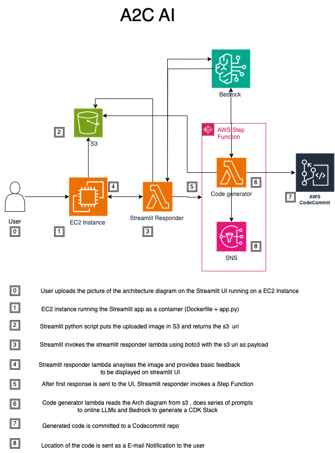

# Architec2Code
Architec2Code AI is a generative AI solution designed to supercharge the development of Data applications on AWS. We leverage a combination of multiple LLM's and agentic workflows, blended with deep knowledge of AWS tool kits, services and design patterns to produce high quality output.

To demo a working example of this application without deploying your own copy, you can visit [www.architec2code.com](http://architec2code.com).

## Solution Architecture


## Deployment Architecture


## Configuration and Deployment

### Prerequisites
- An [AWS account](https://aws.amazon.com/account/)
- An IDE (Cloud9 or local) with [AWS CLI](https://aws.amazon.com/cli/) and [AWS CDK](https://aws.amazon.com/cdk/) installed
- Approved Bedrock model access to Claude 3 Sonnet

### Clone Repository
Clone the Gitlab repo.
```bash
git clone git@ssh.gitlab.aws.dev:2024-data-hackathon/HACK-276.git
```

### Edit configuration files
Open the project folder in your IDE and edit the following files:

- export_vars.sh - This file contains all of the necessary deployment configuration env variables. Update the placeholder values with the correct ones for your targeted deployment account.

- (OPTIONAL) package.json  - The config section of this file can be modified to change the Application Name and CDK Qualifier

- (OPTIONAL) cdk.json - The CDK Qualifier must also be updated here if modifying.

- (OPTIONAL) bin/datahackathon.ts - Update the recipientEmailAddresses array under the ProcessingStack with user emails who wish to receive notifications when generated code is commited. 

### Make the script executable and source the variables
Open your IDE CLI and run the follwing commands:
```bash
chmod +x export_vars.sh
source export_vars.sh
```

### Install dependencies
Install the required CDK dependencies.
```bash
npm ci
```

### Bootstrap the account
Prepare the account for CDK deployment.
```bash
cdk bootstrap --profile $AWS_PROFILE --qualifier ${CDK_QUALIFIER} aws://${AWS_ACCOUNT_ID}/${AWS_REGION}
```

### Deploy
Deploy the project using CDK.
```bash
cdk deploy --all --require-approval never
```

### Verify Deployment
Configuration of the EC2 instance takes approximately 3 to 5 minutes after stack deployment completes. Please allow extra time for this to happen before proceeding. 

Verify that the web page is functioning correctly by logging into the AWS Console, navigating to CloudFormation, selecting the FrontEndStack, and selecting the Outputs tab. Here you will see the public DNS name of the instance that will link you to the web page. Note: The page is accessible over HTTP only, not HTTPS. Verify that your browser is not defaulting to an HTTPS connection if experiencing connection issues.

## Usage Instructions
1. Navigate to the web page
2. Upload a high quality PNG image of a AWS Architecture diagram for any Data Platform type architecture. These are generally derived from the AWS Modern Data Architecture Framework - reflecting capabilities for streaming, ETL, ingestion type architectures encompassing AWS Data, Analytics and Database services. A folder of architecture diagram samples has been provided in this repo.
3. Although Architec2Code(A2C) AI can process and generate CDK stacks for any AWS Architecture drawing, it's fine-tuned for high quality Infrastructure as Code 
4. A2C AI will first analyse the drawing and provide a response to the answer with a description of what it sees, also initiating the workflow for code synthesis in parallel
5. Once the Code synthesis is complete, the underlying Agent will commit the produced code to the output codecommit repository and notify the users by E-mail (Note: The website E-mail field is non functional at this time. Please see the 'Edit configuration files' section for adding users to E-mail list for recieving output notifications)

## Useful commands

* `cdk list`        lists the full names of all stacks for targeted deployment/update
* `npm run build`   compile typescript to js
* `npm run watch`   watch for changes and compile
* `npm run lint:fix`fixes formatting issues
* `npm run test`    perform the jest unit tests
* `npx cdk deploy`  deploy this stack to your default AWS account/region
* `npx cdk diff`    compare deployed stack with current state
* `npx cdk synth`   emits the synthesized CloudFormation template

Contact us for feedback and feature requests: [bpawlow@amazon.com](mailto:bpawlow@amazon.com)