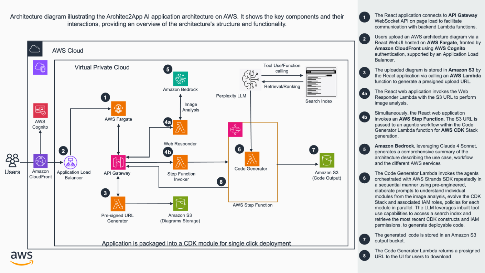

# Guidance to Generate IaC Templates Directly from Architecture Diagrams

## Table of Contents
- [Overview](#overview)
  - [Cost](#cost)
- [Prerequisites](#prerequisites)
  - [Operating System](#operating-system)
- [Deployment Steps](#deployment-steps)
- [Deployment Validation](#deployment-validation)
- [Running the Guidance](#running-the-guidance)
- [Next Steps](#next-steps)
- [Cleanup](#cleanup)
- [FAQ, Known Issues, Additional Considerations, and Limitations](#faq-known-issues-additional-considerations-and-limitations)
- [Revisions](#revisions)
- [Notices](#notices)
- [Authors](#authors)

## Overview
The Journey from Architecture drawings to their deployment can be vastly accelerated by leveraging the potential of Large Language Models. However , given that IaC tools like AWS CDK(Cloud Development Kit) evolve rapidly with frequent new releases /updates , leveraging stand alone LLM’s trained in the past often leads to inaccuracies and hallucinations, when they are used to produce CDK stacks using AWS CDK. 

In addition, for architecture drawing that have higher levels of complexity, highly elaborate and nuanced prompts are essential to produce truly deployable IaC templates. Prompting efforts from the user also scale exponentially as the complexity levels of the architecture under consideration are increased.

This guidance helps users to produce accurate, natively modular AWS CDK stacks  in Python and in typescript with the CDK constructs/syntax retrieved from the latest AWS CDK release. In addition , the required IAM Roles and permissions are also identified and added to the stacks automatically during the code generation process. this is achieved using highly Optimized Chain of Thought prompting for IaC generation in combination with  online LLM’s for code generation and leveraging multimodal LLM’s for Architecture diagram Analysis. 

In addition , Architec2Code AI leverages the multimodal capabilities of LLM’s in combination with carefully optimized Prompts to produce a nuanced understanding of the provided architecture - analysing not only the individual resources present, but distinct functional modules , interactions between AWS resources or account boundaries that maybe depicted in the architecture , informing the code generation process accordingly. 



### Cost
Coming soon

## Prerequisites

### Operating System
- This Guidance can be deployed using Windows, MacOS, or Linux. 
- An IDE, AWS CDK and AWS CLI are required.
- NPM installed
- Docker

### Third Party Tools
Perplexity API Key

### AWS Account Requirements
Approved Bedrock access to Claude 3.5 Sonnet in the desired deployment region.

### Supported Regions
Any region that supports Claude 3.5 Sonnet on Bedrock is a viable deployment target. 
This currently includes: us-east-1, us-west-2, eu-central-1, ap-northeast-1, and ap-southeast-1.

## Deployment Steps

### 1. Clone Repository
Clone the Github repo.
```bash
git clone git@github.com:aws-solutions-library-samples/guidance-for-developing-infrastructure-as-code-templates-from-architecture-diagrams-on-aws.git
```
### 2. Edit configuration files
Open the project folder in your IDE and edit the following files:
- export_vars.sh - This file contains all of the necessary deployment configuration env variables. Update the placeholder values with the correct ones for your targeted deployment account.
- (OPTIONAL) package.json  - The config section of this file can be modified to change the Application Name and CDK Qualifier
- (OPTIONAL) cdk.json - The CDK Qualifier must also be updated here if modifying.
- (OPTIONAL) bin/datahackathon.ts - Update the recipientEmailAddresses array under the ProcessingStack with user emails who wish to receive notifications when newly generated code is uploaded to the S3 output bucket. 

### 3. Make the script executable and source the variables
Open your IDE CLI and run the follwing commands:
```bash
chmod +x export_vars.sh
source export_vars.sh
```
### 4. Install dependencies
Install the required CDK dependencies.
```bash
npm ci
```
### 5. Bootstrap the account
Prepare the account for CDK deployment.
```bash
cdk bootstrap --profile $AWS_PROFILE --qualifier ${CDK_QUALIFIER} aws://${AWS_ACCOUNT_ID}/${AWS_REGION}
```
### 6. Deploy
Deploy the project using CDK.
```bash
cdk deploy --all --require-approval never
```
### 7. Upload API Key
In the AWS Console, navigate to Secrets Manager and copy your Perplexity API key to the newly created Secrets Manager secret named 'ApiKeySecret'.

## Deployment Validation
Open CloudFormation console and verify the status of the template with the name starting with “A2C”.

If deployment is successful, you should see a running EC2 instance with the name starting with “A2C” in the EC2 console.
Configuration of the EC2 instance takes approximately 3 to 5 minutes after stack deployment completes. Please allow extra time for this to happen before proceeding.
 
Verify that the web page is functioning correctly by navigating to the CloudFormation console, selecting the FrontEndStack, and selecting the Outputs tab. Here you will see the public DNS name of the instance that will open the server’s public web page. Note: The page is accessible over HTTP only, not HTTPS. Verify that your browser is not defaulting to an HTTPS connection if experiencing connection issues.

## Running the Guidance
1. Navigate to the web page
2. Upload a high quality PNG image of a AWS Architecture diagram for any Data Platform type architecture. These are generally derived from the AWS Modern Data Architecture Framework - reflecting capabilities for streaming, ETL, ingestion type architectures encompassing AWS Data, Analytics and Database services. A folder of architecture diagram samples has been provided in this repo.
3. A2C AI will first analyse the drawing and provide a response to the answer with a description of what it sees, also initiating the workflow for code synthesis in parallel. NOTE: Although Architec2Code(A2C) AI can process and generate CDK stacks for any AWS Architecture drawing, it's fine-tuned for high quality Infrastructure as Code
4. Once the Code synthesis is complete, the underlying Agent will commit the produced code to the output codecommit repository and notify the users by E-mail (Note: The website E-mail field is non functional at this time. Please see the 'Edit configuration files' section for adding users to E-mail list for receiving output notifications)

## Next Steps
1. Model Selection: The model used for code generation can be selected from the list of supported models by the API provider. For Perplexity, the information can be found here . For Architecture diagram analysis, review the list of available foundation models with multimodal capabilities here to experiment with other models. To adjust the model for code generation, change the  model name in the model_name.yaml 
2. Email notifications to end users: By default, this solution deploys an SNS topic that is intended for administrators to add their emails to. They will automatically be subscribed to the topic upon solution deployment and will receive a notification every time the service is used, along with a link to download the code output from S3. In order to enable webpage email input, SES can be integrated into the solution by having the Processing Lambda function send its output notifications to SES in addition to SNS. The solution is already configured to pass along a user’s email in the event payload to the Processing Lambda. Proper IAM permissions must be added to the function and SES configuration must be completed in the account separately. 

## Cleanup
Delete all 3 A2C Cloudformation stacks using the Cloudformation console or CDK destroy commands. All three S3 buckets deployed in this solution will automatically be emptied and deleted upon stack removal.

## FAQ, known issues, additional considerations, and limitations

### FAQ
1. What other best practices can the user follow while using this solution  to maximise the quality of the output produced?

a. Pay attention to the image clarity and the conceptual clarity of the architecture being depicted. Are all resources described clearly. Check whether the different functional modules  /Account boundaries if any represented clearly. consider adding short phrases as guiding text if parts of the drawing are particularly complex. 

b. For reviewing and optimizing the generated CDK stacks, consider using the Amazon Q Developer extension on your IDE. Use the inline chat feature and ask Q to review the correctness and further optimize the generated stack for any additional best practices.  The authors highly recommend the combined use of Architec2Code AI and Amazon Q developer for rapid implementation of AWS architectures and a truly Next Generation Developer Experience. 


2. How can we adapt this solution so that the generated code is natively compatible with the user’s/organization’s development practices/specifications ?


In order to customize the implementation already during the code generation process, the module_prompts.yaml needs to be edited to list the requirements. Examples are shown how naming conventions can be specified for s3 buckets , attribute preferences for Lambda consructs. 

3. How can  the user alter the model used for the code generation process? 

As described above in the next steps section

4. What programming languages are currently supported by the solution?

The solution supports and has been tested for CDK Stack generation in Python and in Typescript. 

## Authors
Benjamin Pawlowski, Srikrishna Chaitanya Konduru, Srikanth Potu